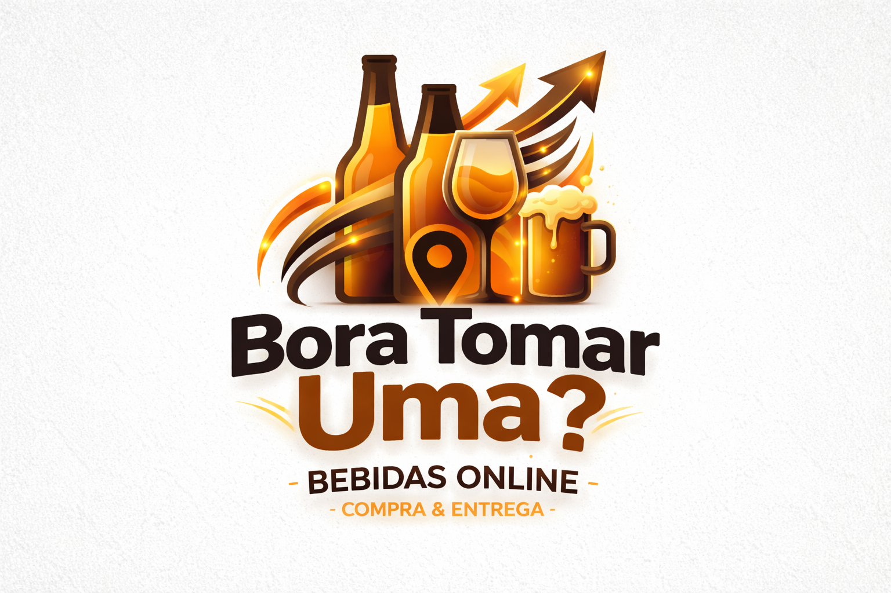

# 🍻 Bora Tomar Uma?

O **Bora Tomar Uma?** é uma plataforma de delivery especializada na comercialização e entrega expressa de bebidas alcoólicas e não alcoólicas. O sistema visa solucionar gargalos logísticos, como a entrega de "última milha", oferecendo agilidade e conveniência para o público de São Paulo.

🚀 **Acesse o sistema:** [https://tayna.free.nf/?i=1](https://tayna.free.nf/?i=1)

---

## 🛠️ Tecnologias e Infraestrutura

O projeto utiliza uma stack focada em escalabilidade, segurança e alta disponibilidade:

* **Linguagem:** PHP (Backend & Lógica).
* **Banco de Dados:** MySQL 8.0 (Estrutura normalizada).
* **Containerização:** Docker para isolamento de ambientes.
* **Versionamento:** GitHub.
* **DevOps:** Pipeline CI/CD com monitoramento em tempo real.

### 📈 Métricas de Performance
* **Uptime:** 99.9%.
* **Latência:** 45ms.
* **Segurança:** Autenticação segura e 100% de Compliance.

---

## 📋 Funcionalidades (CRUD)

| Operação | Descrição |
| :--- | :--- |
| **Create** | Cadastro de produtos, clientes e pedidos com validação de maioridade. |
| **Read** | Consulta de estoque, status de pedidos e relatórios detalhados. |
| **Update** | Atualização de preços, dados cadastrais e níveis de estoque. |
| **Delete** | Remoção de itens obsoletos e cancelamento de pedidos pendentes. |

---

## 👥 Equipe de Desenvolvimento

Projeto desenvolvido por alunos do curso de **ADS** da **UNINOVE (Campus Vergueiro)**:

* Amy Lee Luana Belen Canaviri Beltran
* Cesar Augusto Barbosa de Sousa
* Eduarda Luize Loula Simionato
* Gustavo Cordeiro Hernandez
* Isabella Vieira Guimarães Campelo
* Jaqueline Oliveira Santos
* Júlia Albino Ramos
* Kathia Santalla Roque
* Lucas Rodrigues Santos
* Maiara do Carmo Covelo
* Maria Eduarda Souza Santos
* Samara Feitosa Borges Ribeiro
* Tayná Cristina Passos da Costa

---
**Status do Projeto:** Ativo 🟢
**Localização:** São Paulo, 2026
